# MkDocs Enric

For full documentation visit [mkdocs.org](https://www.mkdocs.org).

## Explicació instalasio maquina

A la instalació básica lo unico que cambiarem sera el espai a 50 gb

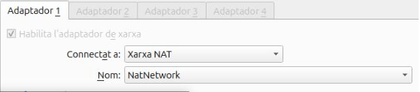

Després haurem d’anar a crear la xarxa nat i li ficarem un nom amb el meu cas el he deixat predeterminat

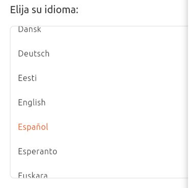

Seleccionarem el idioma i elegim el que vulgem

Selecionarem a conectarse per cable i seguim ficant tot en predeterminat

Aqui cambiem i fiquem instalació manual

Aquí fem 3 particions 10 gb per a swap, 25 per al /home i el que queda a la arrel ( / )

Fem la configuració basica del ubuntu fiquem el nom de la màquina i la contrasenya

Fem la configuració basica del ubuntu fiquem el nom de la màquina i la contrasenya

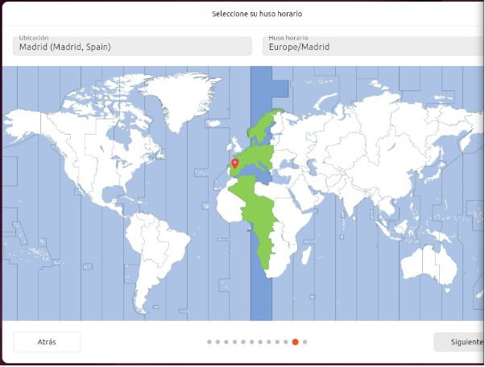

Selecionem de hon som li donarem a següent i instalar

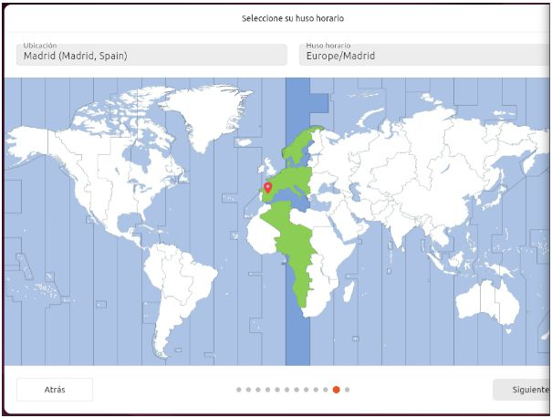

Selecionem de hon som li donarem a següent i instalar

Despres de la configuracio de la nat mirem si ens funciona la xarxa i si tenim una ip bona  
Despres de la configuracio de la nat mirem si ens funciona la xarxa i si tenim una ip bona

## Explicació Boot repair

Configurem el directori `/etc/netplan/01-network-manager-all.yaml`

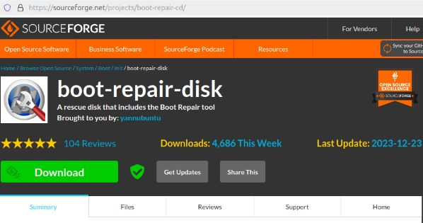

Aqui es veu que instalem la iso de bot-repair

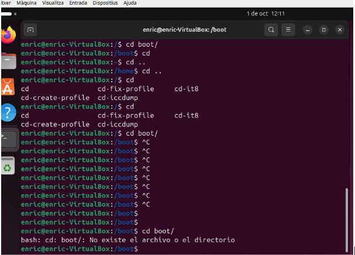

Aqui mirem les comandes i mirem que em eliminat el boot i mirem que no esta el boot

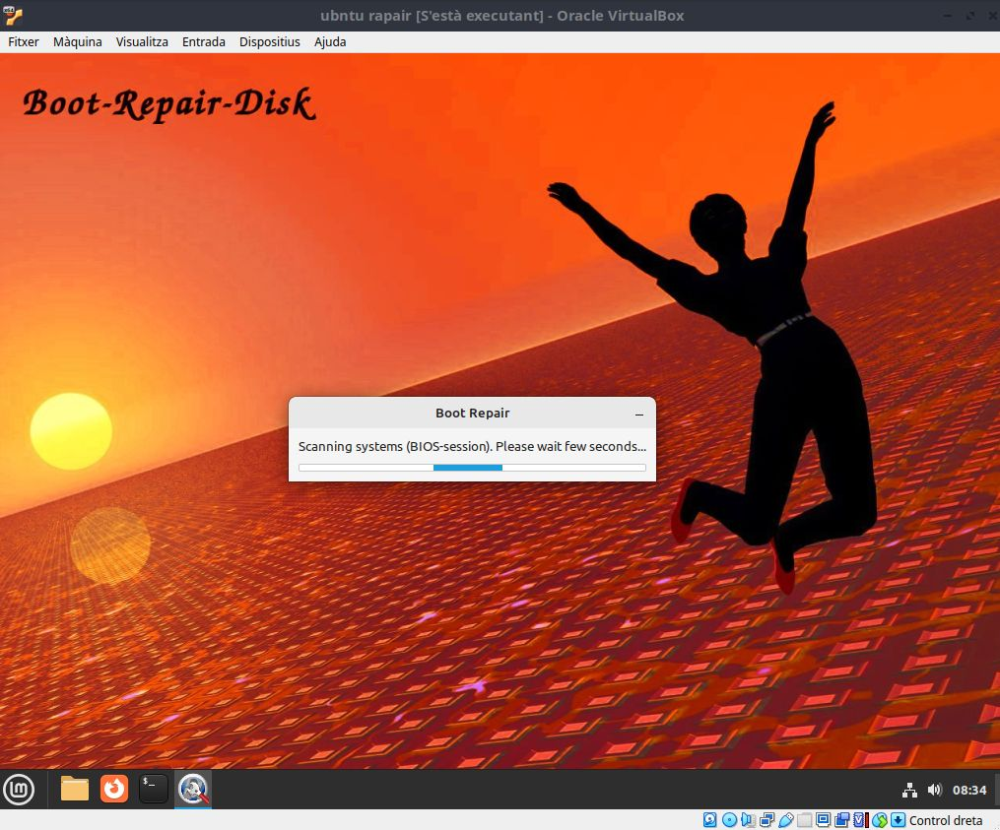

Aqui es veu que eliminem les coses de la carpeta boot i despres tornem a fer la instalació i ja estaria solucionat

## Instalació i desinstalació de aplicacuio

Qui es veu que crem el repositori per instalar el telegram a la maquina virtual

Feu un `sudo apt update` per actualizar i que aparege el repositori i no surtiguen errors inesperats

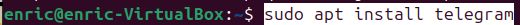

Fem el install del telegram i esprem a que se instale

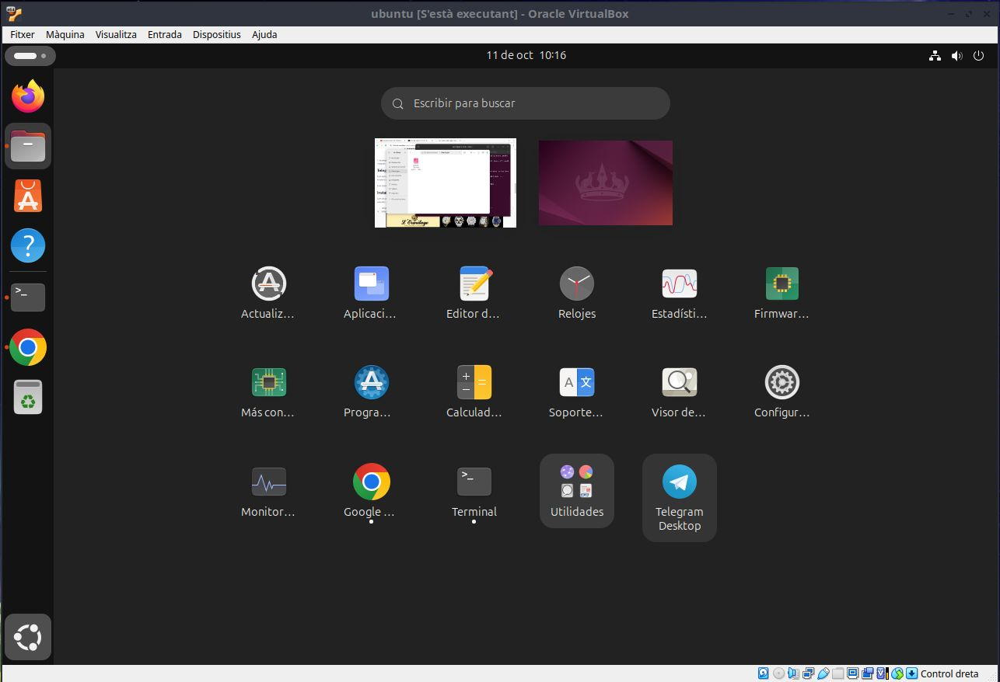

Aqui es veu que esta instalat el telegram

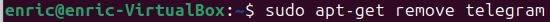

Fiquem la comanda per eliminar el telegram i revisem que estigui eliminat

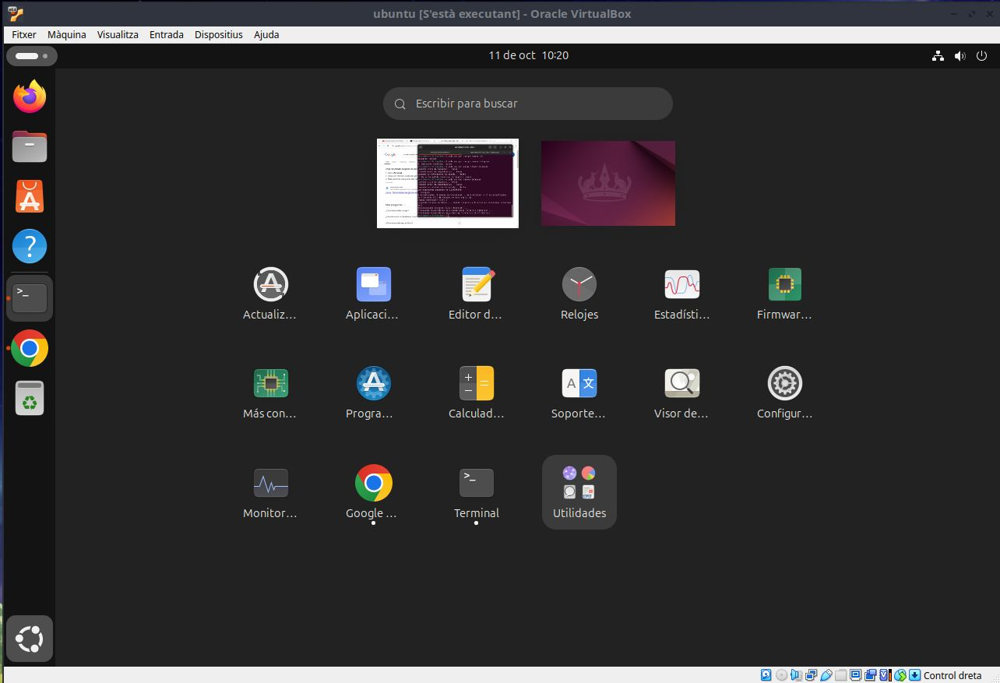

Com es pot comprobar esta eliminat

## Creative Commons

Enric act © 2024 by Enric is licensed under Creative Commons Attribution 4.0 International Creative Commons